# FunnelCloud — Distributed Execution Agents

> **Status**: Design Phase  
> **Last Updated**: 2025-12-31  
> **Author**: AJ Westerfield

## Vision: Knowledge-Centric AI Infrastructure

FunnelCloud extends Mesosync's capabilities beyond the containerized workspace to **any machine the user controls**. The goal is to build a **Knowledge Network** — a system where AJ can:

1. **Discover** agents across the user's infrastructure
2. **Execute** tasks on the most appropriate machine
3. **Accumulate Knowledge** about systems, files, and patterns
4. **Recall** that knowledge when relevant

Think of it as giving AJ **hands that can reach anywhere** while maintaining a unified **brain that knows what and whom to ask next**. This enables AJ not just to act, but to reason about _where_ and _how_ to gather knowledge across your systems to provide context and cross-domain agentic orchestration capability.

---

## Architecture Overview

```mermaid
flowchart TB
    subgraph User["User Interface"]
        OpenWebUI["Open-WebUI<br/>AJ Persona"]
    end

    subgraph Mesosync["Mesosync Backbone (Docker)"]
        Filter["aj.filter.py<br/>Intent Classification"]
        Orchestrator["Orchestrator<br/>Reasoning Engine"]
        Memory["Memory API<br/>Qdrant (Knowledge Store)"]
        Discovery["Discovery Service<br/>UDP Broadcast"]
        CredentialCache["Credential Cache<br/>Session + Agent Scoped"]
    end

    subgraph Agents["FunnelCloud Agents (.NET 8)"]
        Agent1["Agent: dev-workstation<br/>Windows 11<br/>🔧 PowerShell, .NET, Git"]
        Agent2["Agent: build-server<br/>Ubuntu 22.04<br/>🔧 Docker, Node, Python"]
        Agent3["Agent: nas-server<br/>TrueNAS<br/>🔧 ZFS, SMB, rsync"]
    end

    subgraph Trust["Trust Layer"]
        CA["Build-time CA<br/>Fingerprint Pinned"]
        mTLS["mTLS Verification"]
    end

    OpenWebUI --> Filter
    Filter --> Orchestrator
    Orchestrator --> Memory
    Orchestrator --> Discovery
    Discovery -->|"UDP Broadcast"| Agent1
    Discovery -->|"UDP Broadcast"| Agent2
    Discovery -->|"UDP Broadcast"| Agent3

    Agent1 -->|"mTLS"| mTLS
    Agent2 -->|"mTLS"| mTLS
    Agent3 -->|"mTLS"| mTLS
    mTLS -->|"Verify"| CA

    Orchestrator -->|"Task Dispatch"| Agent1
    Orchestrator -->|"Task Dispatch"| Agent2
    Orchestrator -->|"Task Dispatch"| Agent3

    Orchestrator --> CredentialCache

    style Memory fill:#e1f5fe
    style CA fill:#fff3e0
```

---

## Naming Conventions

| Name            | Role     | Description                                                                                                                                                   |
| --------------- | -------- | ------------------------------------------------------------------------------------------------------------------------------------------------------------- |
| **AJ**          | Persona  | User-facing identity in Open-WebUI. "AJ" is who users talk to.                                                                                                |
| **Mesosync**    | Backbone | Python/FastAPI coordination layer. Discovers, authenticates, and orchestrates FunnelCloud agents. Like a mesoscale weather system coordinating funnel clouds. |
| **FunnelCloud** | Agents   | .NET 8 execution agents deployed on user machines. Each agent is a "funnel" that can touch down anywhere.                                                     |
| **Knowledge**   | Goal     | The accumulated understanding of workspaces, systems, and patterns stored in Qdrant.                                                                          |

---

## Core Design Principles

### Trust Model

- **mTLS + Fingerprint Pinning** — Cryptographic identity, not UUIDs
- **Build-time CA Embedding** — Cannot be changed at runtime
- **Certificate Revocation** — Compromise one agent without affecting others

### Discovery

- **Per-Conversation** — UDP broadcast once per chat, not continuously
- **Lazy Re-Discovery** — Re-discover only when an agent fails
- **Capability Advertisement** — Agents broadcast what they can do

### Credentials

- **Try-Then-Elevate** — Assume no elevation needed, prompt when required
- **Session + Agent Scoped** — Credentials cached per agent per session
- **Auth Fallback** — `https://auth.aj.westerfield.cloud/agent/{agent_id}`

### Knowledge

- **Workspace Knowledge** — Project structure, frameworks, observations
- **Agent Knowledge** — System info, capabilities, installed software
- **Unified Store** — Everything flows to Qdrant for semantic recall

---

## Technology Stack

- **Mesosync**: Python/FastAPI (existing Docker services)
- **FunnelCloud Agents**: .NET 8 (cross-platform)
- **Shell Execution**: PowerShell Core via `System.Management.Automation`
- **Communication**: gRPC over mTLS
- **Discovery**: UDP broadcast listener

---

## Implementation Status

### Phase 1: Foundation ✓ (Current)

Mesosync backbone operational with orchestrator, memory, and pragmatics services.

### Phases 2-5: FunnelCloud Development

> **Note**: FunnelCloud agent source code is developed in a separate private repository (`FunnelCloud/` is gitignored).
>
> See [.github/FunnelCloud-Implementation.md](../.github/FunnelCloud-Implementation.md) for detailed implementation plans, sequence diagrams, and code examples.

---

## References

- [ARCHITECTURE.md](../ARCHITECTURE.md) — Current Mesosync architecture
- [.github/copilot-instructions.md](../.github/copilot-instructions.md) — Developer guidance
- [.github/FunnelCloud-Implementation.md](../.github/FunnelCloud-Implementation.md) — Detailed implementation guide (private)
