# FunnelCloud Implementation Guide

> **Status**: Private implementation details for FunnelCloud development  
> **Source**: `FunnelCloud/` directory (gitignored, separate private repo)

This document contains implementation details extracted from the design phase. The public design overview is at [docs/FunnelCloud-Design.md](../docs/FunnelCloud-Design.md).

---

## Trust Model Implementation

### Why mTLS + Fingerprint Pinning?

UUIDs can be stolen. IP addresses can be spoofed. The only secure way to verify an agent's identity is **cryptographic proof**.


### Key Security Properties

1. **Build-time CA Embedding**: The CA certificate fingerprint is compiled into both Mesosync and FunnelCloud agents. No runtime configuration can change it.

2. **No UUID Trust**: Agent IDs are for routing only, not authentication. An attacker who learns an agent ID cannot impersonate it without the private key.

3. **Certificate Revocation**: If an agent is compromised, revoke its certificate. All other agents continue to work.

---

## Discovery Protocol Implementation

### Per-Conversation Discovery

Discovery happens **once per conversation**, not continuously. This is intentional:

- LLM inference takes 2-30 seconds per turn
- UDP broadcast latency is <100ms
- Re-discovering every turn would add negligible latency but significant complexity

### Discovery Flow


### Lazy Re-Discovery

If an agent fails during execution, the system:

1. Completes other parallel tasks normally
2. Marks the failed agent as stale
3. Re-discovers on the **next** task that needs that agent
4. Warns user: "Agent dev-workstation is unreachable"

---

## Credential & Elevation Model Implementation

### Try-Then-Elevate Flow

The system assumes **most commands don't need elevation**. When elevation is required:

```mermaid
sequenceDiagram
    participant U as User
    participant O as Orchestrator
    participant A as FunnelCloud Agent
    participant Auth as auth.aj.westerfield.cloud

    U->>O: "Install Docker on build-server"
    O->>A: Execute: apt install docker.io
    A->>O: Error: ELEVATION_REQUIRED

    O->>U: "🔐 Agent needs elevated permissions"
    O->>U: "[Click to authenticate](https://auth.aj.westerfield.cloud/agent/build-server)"

    U->>Auth: Opens link
    Auth->>U: Credential form (platform-aware)
    U->>Auth: Submit credentials
    Auth->>O: Credentials stored (session + agent scoped)

    O->>A: Retry with credentials
    A->>A: sudo apt install docker.io
    A->>O: Success
    O->>U: "Docker installed successfully"

    Note over O,A: Subsequent elevated commands auto-retry
    U->>O: "Start Docker service"
    O->>A: Execute: systemctl start docker
    A->>O: Error: ELEVATION_REQUIRED
    O->>A: Auto-retry with cached credentials
    A->>O: Success
```



### Platform-Aware Credentials

| Platform    | Credential Type     | Used For                        |
| ----------- | ------------------- | ------------------------------- |
| **Windows** | Username + Password | `runas /user:Admin`, UAC bypass |
| **Linux**   | Sudo Password       | `sudo -S` with stdin password   |
| **macOS**   | Sudo Password       | `sudo -S` with stdin password   |

### Credential Scope

Credentials are cached at **Session + Agent ID** granularity:

```
Session: conv_abc123
├── Agent: dev-workstation → Credentials: {user: "aj", pass: "***"}
├── Agent: build-server → Credentials: {sudo_pass: "***"}
└── Agent: nas-server → (no credentials yet)
```

- Different agents may need different credentials
- Credentials expire with the session
- User can revoke credentials for a specific agent

---

## Knowledge Persistence Implementation

### Workspace Knowledge → Qdrant

When the user says "remember this workspace" or AJ completes significant analysis:

```python
# Serialize workspace knowledge to memory
knowledge_payload = {
    "source_type": "workspace_knowledge",
    "source_name": "aj.westerfield.cloud",
    "user_text": "Workspace knowledge for aj.westerfield.cloud",
    "metadata": {
        "project_types": ["python", "docker"],
        "frameworks": ["fastapi", "pytest", "pydantic"],
        "structure": {
            "layers/": "Service implementations",
            "filters/": "Open-WebUI filter",
            "ollama/": "LLM configuration",
            "docs/": "Documentation"
        },
        "observations": [
            "Multi-service AI platform",
            "4 microservices on Docker",
            "Qdrant for semantic memory",
            "Ollama for local LLM inference"
        ],
        "file_count": 150,
        "total_size": "2.1 MiB",
        "captured_at": "2025-12-31T12:00:00Z"
    }
}
```

Later recall: "What's in my aj.westerfield.cloud project?" triggers memory search.

### Agent Knowledge

FunnelCloud agents can also contribute to the Knowledge store:

```python
# After scanning a new machine
agent_knowledge = {
    "source_type": "agent_knowledge",
    "source_name": "dev-workstation",
    "user_text": "System knowledge for dev-workstation",
    "metadata": {
        "hostname": "DESKTOP-AJ01",
        "os": "Windows 11 Pro",
        "capabilities": ["powershell", "dotnet", "git", "docker"],
        "installed_software": ["VS Code", "Visual Studio 2022", "Docker Desktop"],
        "workspace_roots": ["C:\\Code", "D:\\Projects"],
        "last_seen": "2025-12-31T12:00:00Z"
    }
}
```

---

## Implementation Phases

### Phase 1: Foundation (Current)

- [x] Mesosync backbone (orchestrator, memory, pragmatics)
- [x] Workspace operations (file, shell, polyglot handlers)
- [x] External state tracking (workspace_state.py)
- [ ] Workspace knowledge persistence to Qdrant

### Phase 2: FunnelCloud Agent MVP

- [ ] .NET 8 agent project scaffold
- [ ] UDP discovery listener
- [ ] PowerShell Core execution
- [ ] Self-signed certificate generation

### Phase 3: Trust & Security

- [ ] CA infrastructure (certificate generation scripts)
- [ ] mTLS implementation
- [ ] Fingerprint pinning in both Mesosync and agents

### Phase 4: Credential Management

- [ ] auth.aj.westerfield.cloud endpoint
- [ ] Platform-aware credential forms
- [ ] Session + Agent scoped credential cache
- [ ] Try-then-elevate flow

### Phase 5: Multi-Agent Orchestration

- [ ] Parallel task dispatch to multiple agents
- [ ] Agent selection heuristics
- [ ] Failure handling and re-discovery
- [ ] Agent knowledge accumulation

---

## Open Questions

1. **Agent Deployment**: How do users install FunnelCloud agents? MSI for Windows? DEB/RPM for Linux? Single binary download?

2. **Certificate Distribution**: How does the user get agent certificates signed by the CA? Web UI? CLI tool?

3. **Agent Updates**: How do agents update themselves? Auto-update from Mesosync? Manual?

4. **Network Topology**: What if agents are behind NAT? VPN? Tailscale integration?

---

## Project Structure

```
FunnelCloud/
├── FunnelCloud.Agent/           # Main agent executable
│   ├── Program.cs               # Entry point
│   ├── Services/
│   │   ├── DiscoveryListener.cs # UDP broadcast responder
│   │   ├── TaskExecutor.cs      # PowerShell/shell execution
│   │   ├── CredentialStore.cs   # Secure credential handling
│   │   └── ElevationManager.cs  # Platform-specific elevation
│   └── Certificates/
│       └── ca-fingerprint.txt   # Build-time embedded CA fingerprint
├── FunnelCloud.Shared/          # Shared models/contracts
│   ├── TaskRequest.cs
│   ├── TaskResult.cs
│   └── AgentCapabilities.cs
└── FunnelCloud.Tests/
```

### Agent Capabilities Advertisement

Each agent advertises its capabilities during discovery:

```json
{
  "agent_id": "dev-workstation",
  "hostname": "DESKTOP-AJ01",
  "platform": "windows",
  "capabilities": ["powershell", "dotnet", "git", "docker"],
  "workspace_roots": ["C:\\Code", "D:\\Projects"],
  "certificate_fingerprint": "SHA256:abc123..."
}
```
