# Mesosync System Overview

> **Knowledge-Centric AI Infrastructure**

```mermaid
flowchart TB
    subgraph UserLayer["User Layer"]
        User["👤 User"]
        OpenWebUI["Open-WebUI<br/>AJ Persona"]
    end

    subgraph MesosyncCore["Mesosync Core (Docker)"]
        direction TB

        subgraph Routing["Intent Routing"]
            Filter["aj.filter.py"]
            Pragmatics["Pragmatics<br/>Intent Classifier"]
        end

        subgraph Reasoning["Reasoning Layer"]
            Orchestrator["Orchestrator<br/>ReasoningEngine"]
            State["WorkspaceState<br/>Ground Truth"]
        end

        subgraph Execution["Execution Layer"]
            Dispatcher["ToolDispatcher"]
            FileHandler["FileHandler"]
            ShellHandler["ShellHandler"]
            PolyglotHandler["PolyglotHandler"]
        end

        subgraph Knowledge["Knowledge Layer"]
            Memory["Memory API"]
            Qdrant[("Qdrant<br/>Vector DB")]
        end

        subgraph Extraction["Extraction Layer"]
            Extractor["Extractor API"]
            LLaVA["LLaVA<br/>Vision"]
            Whisper["Whisper<br/>Audio"]
        end
    end

    subgraph FunnelCloudLayer["FunnelCloud Agents (Planned)"]
        direction LR
        Discovery["Discovery<br/>UDP Broadcast"]

        Agent1["🖥️ dev-workstation<br/>Windows"]
        Agent2["🐧 build-server<br/>Linux"]
        Agent3["📦 nas-server<br/>TrueNAS"]
    end

    subgraph Infrastructure["Infrastructure"]
        Ollama["Ollama<br/>LLM Inference"]
        Workspace[("Workspace<br/>Mounted Volume")]
        AuthEndpoint["auth.aj.westerfield.cloud<br/>Credential Input"]
    end

    %% User flow
    User --> OpenWebUI
    OpenWebUI --> Filter
    Filter --> Pragmatics
    Pragmatics --> Filter

    %% Intent routing
    Filter -->|"task"| Orchestrator
    Filter -->|"save/recall"| Memory

    %% Orchestrator flow
    Orchestrator --> State
    Orchestrator --> Dispatcher
    Orchestrator --> Ollama
    Orchestrator -->|"patterns"| Memory

    %% Tool execution
    Dispatcher --> FileHandler
    Dispatcher --> ShellHandler
    Dispatcher --> PolyglotHandler
    FileHandler --> Workspace
    ShellHandler --> Workspace

    %% Knowledge flow
    Memory --> Qdrant

    %% Extraction
    Extractor --> LLaVA
    Extractor --> Whisper

    %% FunnelCloud (planned)
    Orchestrator -.->|"planned"| Discovery
    Discovery -.-> Agent1
    Discovery -.-> Agent2
    Discovery -.-> Agent3
    Agent1 -.->|"mTLS"| Orchestrator
    Agent2 -.->|"mTLS"| Orchestrator
    Agent3 -.->|"mTLS"| Orchestrator

    %% Auth fallback
    Agent1 -.->|"elevation required"| AuthEndpoint
    Agent2 -.->|"elevation required"| AuthEndpoint
    Agent3 -.->|"elevation required"| AuthEndpoint

    style Knowledge fill:#e3f2fd
    style FunnelCloudLayer fill:#fff8e1,stroke-dasharray: 5 5
    style AuthEndpoint fill:#ffebee
```

## The Goal: Knowledge

The entire system exists to serve one purpose: **accumulate and recall knowledge**.

| Layer                  | Knowledge Contribution                                    |
| ---------------------- | --------------------------------------------------------- |
| **Memory API**         | Stores facts, preferences, and context from conversations |
| **WorkspaceState**     | Tracks file structure, project types, observations        |
| **FunnelCloud Agents** | Learn about remote systems, software, capabilities        |
| **Qdrant**             | Persists all knowledge for semantic recall                |

When a user asks "What's in my project?" or "What servers do I have?", the system should recall — not re-discover.

## Naming Quick Reference

| Name            | What It Is                | Where It Lives                   |
| --------------- | ------------------------- | -------------------------------- |
| **AJ**          | User-facing persona       | Open-WebUI chat interface        |
| **Mesosync**    | Coordination backbone     | Docker services (Python/FastAPI) |
| **FunnelCloud** | Distributed agents        | User machines (.NET 8)           |
| **Knowledge**   | Accumulated understanding | Qdrant vector database           |

## Service Ports

| Port  | Service          | Purpose                                    |
| ----- | ---------------- | ------------------------------------------ |
| 8000  | memory_api       | Semantic memory (Qdrant + embeddings)      |
| 8001  | pragmatics_api   | Intent classification (4-class DistilBERT) |
| 8002  | extractor_api    | Media extraction (LLaVA, Whisper)          |
| 8004  | orchestrator_api | Reasoning engine + tool execution          |
| 6333  | qdrant           | Vector database                            |
| 11434 | ollama           | LLM inference                              |
| 8180  | open-webui       | Chat UI                                    |

## Data Flows

### Task Execution (Current)

### Knowledge Recall

### FunnelCloud Execution (Planned)

## Related Documentation

- [ARCHITECTURE.md](../ARCHITECTURE.md) — Detailed service architecture
- [FunnelCloud-Design.md](FunnelCloud-Design.md) — FunnelCloud agent design
- [.github/copilot-instructions.md](../.github/copilot-instructions.md) — Developer guidance
