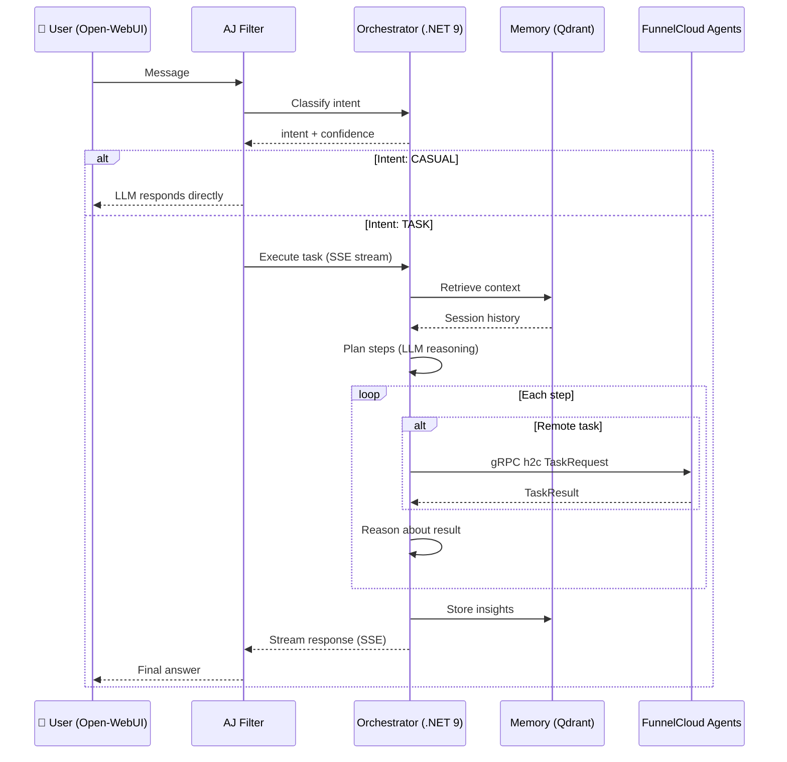
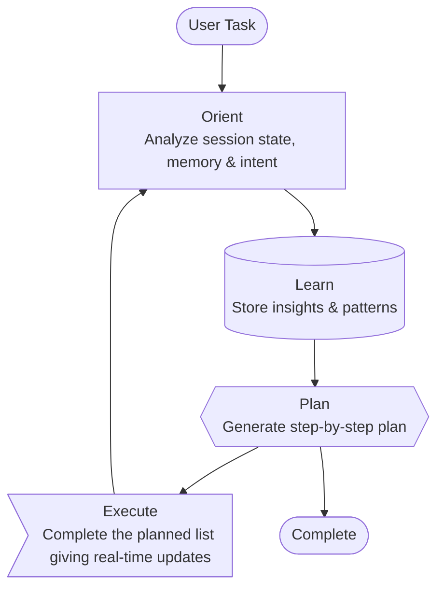
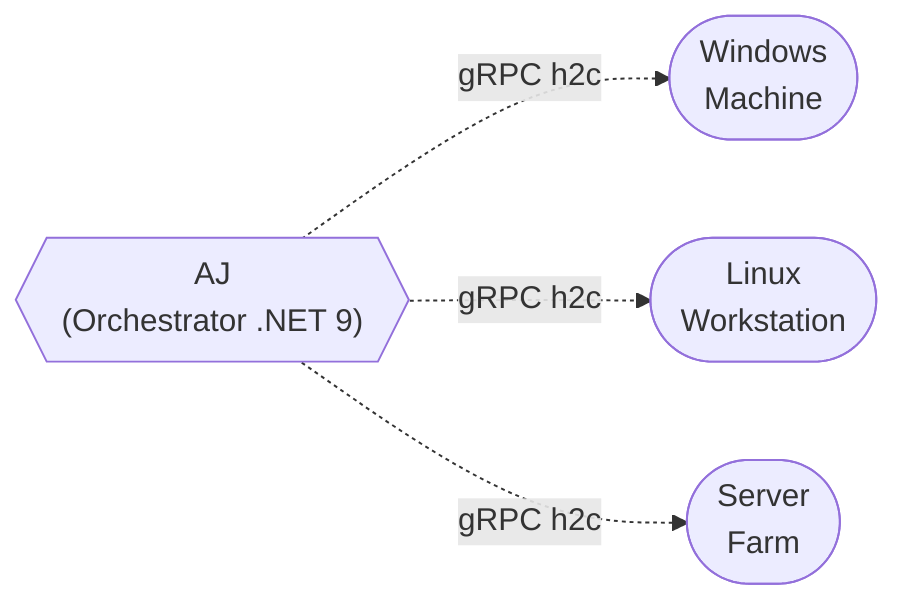
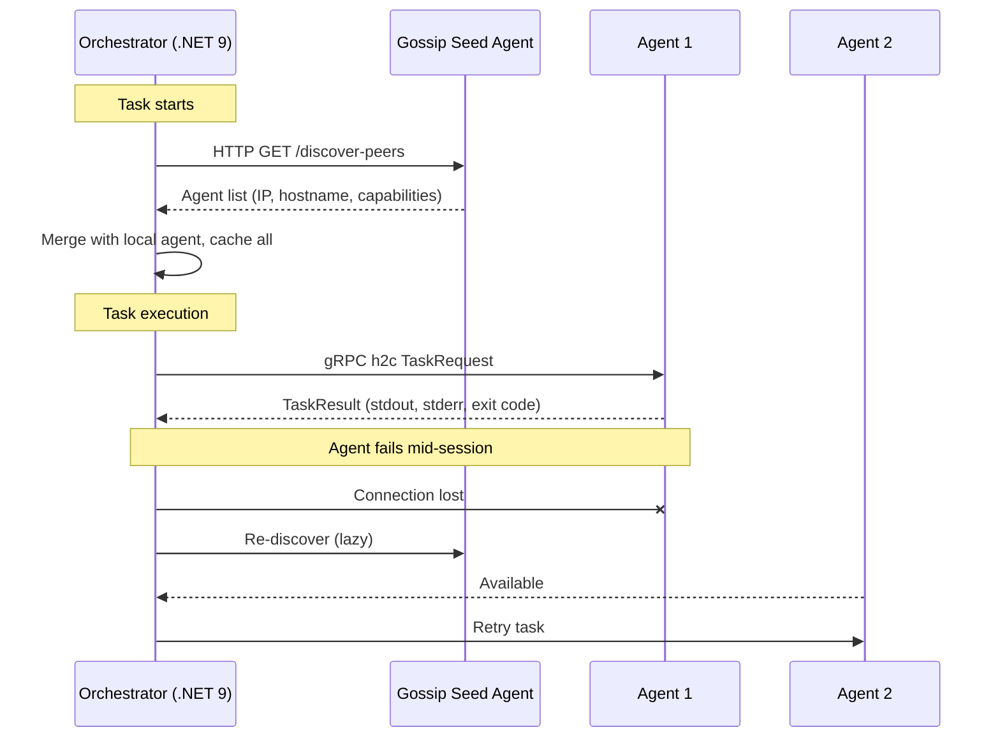

# AJ: Knowledge-Centric AI Infrastructure

A privacy-first, locally-hosted **AJ**entic AI infrastructure assistant that combines intent-driven orchestration with semantic memory—rather than exposing a catalog of tools for an LLM to pick from, the orchestrator reasons about goals and securely dispatches atomic commands to trusted remote agents based on their self-reported capabilities.

**AJ learns learns as you go.** based on a pragmatic and agentic approach. AJ's focus is on:

1. **Privacy** completely local to your environment.
2. **Planning** intelligently based on your workspace and history
3. **Showing Progress** as it works through multi-step tasks
4. **Adapting** based on your feedback and new information
5. **Remembering** what it learns in a semantic vector database
6. **Improving** with every interaction

The AI tooling ecosystem is crowded. Here's where AJ sits — and why it exists.

### The "FunnelCloud Remote Execute" Philosophy

At its core, AJ relies on LLM reasoning and four tools: `list_agents`, `execute`, `think`, and `complete`. The LLM generates commands from its training — PowerShell for Windows, Bash for Linux — and the orchestrator dispatches them to FunnelCloud agents via gRPC.

- **FunnelCloud agents** on Windows/Linux machines (full capability detection)
- **LLM-generated commands**: The model knows how to construct commands from its training
- **No local execution**: All commands run on remote agents, never in the orchestrator container
- **R1 reasoning**: The model uses `<think>` blocks for chain-of-thought before producing tool calls

The orchestrator doesn't provide bash, file read/write, or code execution tools. Instead, the LLM reasons about what commands to run and uses `execute` to dispatch them to the appropriate agent.

The trick is not only knowing _what_ command to generate, but also _which agent_ to run it on. That's where AJ differs from pure tool-exposure protocols.

### Brain vs. Protocol

[Model Context Protocol (MCP)](https://modelcontextprotocol.io/) is a specification for exposing tools to LLMs—think of it as a standard interface. It defines how to describe tools, transport requests, and return results. Clean, standard, interoperable.

**MCP is tool-centric:** Servers advertise their tools, hosts discover them, and the LLM picks from the menu. The LLM sees "here are 47 tools" and decides which to call.

**AJ is intent-centric:** The orchestrator reasons about _what needs to happen_, then dispatches atomic operations to agents. Agents don't advertise a menu—they report capabilities ("I can run PowerShell", "I have GPU access"). The orchestrator plans the solution, then sends specific commands: "run this script", "read this file", "execute this query."

```
MCP:  Tools advertise → Host discovers → LLM picks from menu → Execute

AJ:   Intent classified → Orchestrator reasons → Plan steps → Dispatch atomic ops to agents
```

With MCP, the LLM is the decision-maker given a tool catalog. With AJ, the orchestrator is the decision-maker—it reasons about the problem, plans a solution, and agents are just execution endpoints for atomic operations.

**AJ's agents don't think. They execute.** The thinking happens in the orchestrator, informed by session state, history, and the actual capabilities of discovered agents.

**MCP = tool discovery + invocation protocol. AJ = reasoning engine that plans solutions and dispatches atomic operations. Complementary, not competing.**

### Defined Sequence vs. Adaptive Reasoning

Visual workflow builders like [n8n](https://github.com/n8n-io/n8n) are fantastic for deterministic automation: "When X happens, do Y, then Z." You define the sequence, and execution follows that path.

AJ is more like giving directions to a driver. You say where you want to go; it figures out the route:

| Paradigm       | Workflow Builder       | AJ                           |
| -------------- | ---------------------- | ---------------------------- |
| **You define** | The exact sequence     | The goal                     |
| **Execution**  | Deterministic (A→B→C)  | Adaptive (LLM chooses steps) |
| **State**      | Workflow variables     | Semantic memory (persistent) |
| **Best for**   | Repeatable automations | Adaptive problem-solving     |

Want "every hour, sync CRM to Sheets"? Use a workflow builder—it's the right tool. Want "help me deploy this to whichever server makes sense"? That requires reasoning, context, and the ability to discover available agents on the fly.

They're complementary. AJ could _be called by_ a workflow builder as an automation step. Or AJ could _call_ external automation when the reasoning engine decides that's the right move.

---

## Architecture Overview

### High-Level System Flow


```mermaid
sequenceDiagram
    participant U as 🤖 User (Open-WebUI)
    participant F as AJ Filter
    participant O as Orchestrator (.NET 9)
    participant M as Memory (Qdrant)
    participant A as FunnelCloud Agents

    U->>F: Message
    F->>O: Classify intent
    O-->>F: intent + confidence

    alt Intent: CASUAL
        F-->>U: LLM responds directly
    else Intent: TASK
        F->>O: Execute task (SSE stream)
        O->>M: Retrieve context
        M-->>O: Session history
        O->>O: Plan steps (LLM reasoning)
        loop Each step
            alt Remote task
                O->>A: gRPC h2c TaskRequest
                A-->>O: TaskResult
            end
            O->>O: Reason about result
        end
        O->>M: Store insights
        O-->>F: Stream response (SSE)
        F-->>U: Final answer
    end
```

### System Components

| Component            | Purpose                                                  | Technology                                                                                   | Port  |
| -------------------- | -------------------------------------------------------- | -------------------------------------------------------------------------------------------- | ----- |
| **Filter**           | Intent routing & LLM coordination                        | [Open-WebUI](https://github.com/open-webui/open-webui) Python filter                         | N/A   |
| **Orchestrator API** | Reasoning engine + intent classification + tool dispatch | .NET 9 (C#) + [Ollama](https://github.com/ollama/ollama)                                     | 8004  |
| **Memory API**       | Semantic knowledge storage & recall                      | [Qdrant](https://github.com/qdrant/qdrant) vectors + embeddings                              | 8000  |
| **Extractor API**    | Media processing (PDF, images, audio)                    | [LLaVA](https://github.com/haotian-liu/LLaVA) + [Whisper](https://github.com/openai/whisper) | 8002  |
| **Qdrant**           | Vector database for semantic search                      | [Qdrant](https://github.com/qdrant/qdrant) (in-memory)                                       | 6333  |
| **Ollama**           | Local LLM inference                                      | r1-distill-aj:32b-8k (Q4_K_M, 8192 context)                                                  | 11434 |
| **Ollama Facts**     | Fact extraction for memory                               | qwen2.5:1.5b                                                                                 | 11436 |

---

## How It Works: Plan → Execute → Learn

Every task follows the same learning pattern:


```mermaid

graph TD
    A(["User Task"])
    B["Orient<br/>Analyze session state, memory & intent"]
    C{{"Plan<br/>Generate step-by-step plan"}}
    D>"Execute<br/>Complete the planned list giving real-time updates"]
    E[("Learn<br/>Store insights & patterns")]
    F(["Complete"])

    A --> B --> E --> C --> D --> B
    C --> F
```

This is **agentic reasoning**: not just executing, but thinking, adapting, and learning. You're not talking to a lookup table—you're working with an agent that reasons in real-time.

---

## FunnelCloud: Distributed Agents

For machines that can run software, FunnelCloud agents provide rich capability detection and secure execution. For everything else (switches, appliances, cloud services), the orchestrator uses SSH or API calls directly.

### Why Agents? Self-Describing Infrastructure

A key benefit: **you don't have to teach the LLM your IT stack**. Agents self-report their capabilities at discovery time — installed tools, server roles, platform details. The orchestrator knows what's possible before planning any task.

```
"I need to query Active Directory"
  → Orchestrator sees: domain02 has role:domain-controller
  → Routes AD commands to domain02 automatically

"Restart the web server"
  → Orchestrator sees: webprod01 has role:iis-web-server, webprod02 has role:nginx
  → Asks: "Which web server? IIS on webprod01 or nginx on webprod02?"
```

For network equipment (UniFi, Cisco, etc.), MCP servers can provide the same self-describing pattern — expose device capabilities as tools, and the orchestrator treats them like any other infrastructure.


```mermaid
graph LR
    M{{"AJ<br/>(Orchestrator .NET 9)"}}
    W1(["Windows<br/>Machine"])
    L1(["Linux<br/>Workstation"])
    S1(["Server<br/>Farm"])

    M -.->|"gRPC h2c"| W1
    M -.->|"gRPC h2c"| L1
    M -.->|"gRPC h2c"| S1
```

**Agent Discovery Sequence:**


```mermaid
sequenceDiagram
    participant O as Orchestrator (.NET 9)
    participant S as Gossip Seed Agent
    participant A1 as Agent 1
    participant A2 as Agent 2

    Note over O: Task starts
    O->>S: HTTP GET /discover-peers
    S-->>O: Agent list (IP, hostname, capabilities)
    O->>O: Merge with local agent, cache all

    Note over O: Task execution
    O->>A1: gRPC h2c TaskRequest
    A1-->>O: TaskResult (stdout, stderr, exit code)

    Note over O,A1: Agent fails mid-session
    O-xA1: Connection lost
    O->>S: Re-discover (lazy)
    A2-->>O: Available
    O->>A2: Retry task
```

- **Gossip-seed discovery** (HTTP-based, cross-subnet capable)
- **gRPC h2c** (insecure HTTP/2 for task execution — mTLS planned)
- **One-click deployment** to Windows machines
- **Server role detection** (Windows: DC, DNS, DHCP, Exchange, SQL Server, IIS, Hyper-V, File Server; Linux: nginx, Apache, MySQL, PostgreSQL, Docker, Kubernetes)

**Deploy an agent:**

```powershell
# From the target machine (run as Administrator)
.\Deploy-FunnelCloudAgent.ps1 -BuildServer "your-build-server"
```

See [FunnelCloud/README.md](layers/agents/FunnelCloud/README.md) for full setup guide.

---

## Getting Started

### Prerequisites

- Docker & Docker Compose
- GPU (recommended for LLM inference)
- Python 3.10+
- Open-WebUI instance
- 24GB+ VRAM recommended for 32B models (RTX 3090/4090, A100, H100)

### VRAM Requirements

| Model Configuration              | VRAM Usage | Notes                            |
| -------------------------------- | ---------- | -------------------------------- |
| `r1-distill-aj:32b-4k` (Q4_K_M)  | ~20 GB     | Safe headroom on 24GB GPU        |
| `r1-distill-aj:32b-8k` (Q4_K_M)  | ~22 GB     | Tight fit, may spill ~9% to CPU  |
| `aj-q8:latest` (Q8_0)            | ~34 GB     | Requires 48GB+ GPU               |
| `qwen2.5:1.5b` (fact extraction) | ~1 GB      | Runs on separate Ollama instance |

### Quick Start

```bash
# 1. Clone and configure
git clone <repo>
cd aj.westerfield.cloud
cp .env.example .env

# 2. Configure Open-WebUI connection
export WEBUI_URL=http://localhost:8180
export WEBUI_API_KEY=$(cat secrets/webui_admin_api_key.txt)

# 3. Start all services
docker compose up -d

# 4. Verify services are running
docker compose ps

# 5. Deploy AJ filter to Open-WebUI
./scripts/deploy-filter.ps1
```

### Ollama Configuration

AJ uses two Ollama instances to avoid model unloading conflicts:

| Instance       | Port  | Model                  | Purpose                             |
| -------------- | ----- | ---------------------- | ----------------------------------- |
| `ollama`       | 11434 | `r1-distill-aj:32b-8k` | Main reasoning (32B, 8k context)    |
| `ollama-facts` | 11436 | `qwen2.5:1.5b`         | Fact extraction (1.5B, lightweight) |

**Key environment variables:**

```yaml
environment:
  - OLLAMA_KEEP_ALIVE=-1 # Keep models loaded forever (never unload)
  - OLLAMA_NUM_PARALLEL=1 # Only 1 concurrent request to prevent double-loads
  - OLLAMA_MAX_LOADED_MODELS=1 # Maximum 1 model loaded at a time
```

**Model quantization (GGUF format):**

| Quantization | Bits | Quality        | 32B Model Size |
| ------------ | ---- | -------------- | -------------- |
| Q2_K         | ~2.5 | Poor           | ~12 GB         |
| Q3_K_M       | ~3.5 | Fair           | ~15 GB         |
| **Q4_K_M**   | ~4.5 | Good (default) | ~19 GB         |
| Q5_K_M       | ~5.5 | Very Good      | ~22 GB         |
| Q6_K         | ~6.5 | Excellent      | ~26 GB         |
| Q8_0         | 8    | Near-lossless  | ~34 GB         |

**Healthcheck:** The Ollama container runs a test prompt on startup to ensure the model is loaded before marking healthy. The `ollama/ollama:latest` image doesn't include `curl`, so healthchecks use the `ollama` CLI directly.

**Switching models:**

```bash
# Available r1-distill-aj variants
ollama list | grep r1-distill
# r1-distill-aj:32b-2k   (2048 context)
# r1-distill-aj:32b-4k   (4096 context)
# r1-distill-aj:32b-8k   (8192 context)
# r1-distill-aj:32b      (default)
```

### Auto-Start on Windows Boot

To automatically start AJ services when Windows boots (using WSL2 + Docker Engine), create a scheduled task:

```powershell
# Run as Administrator
# Note: Replace 'Debian' with your WSL distro name (check with: wsl -l -v)
$Action = New-ScheduledTaskAction -Execute "wsl.exe" -Argument "-d Debian -u root -- bash -c 'service docker start && cd /mnt/c/Code/aj.westerfield.cloud && docker compose up -d'"
$Trigger = New-ScheduledTaskTrigger -AtStartup
$Settings = New-ScheduledTaskSettingsSet -AllowStartIfOnBatteries -DontStopIfGoingOnBatteries -StartWhenAvailable -RunOnlyIfNetworkAvailable
$Principal = New-ScheduledTaskPrincipal -UserId "SYSTEM" -LogonType ServiceAccount -RunLevel Highest
Register-ScheduledTask -TaskName "AJ-Westerfield-Services" -Action $Action -Trigger $Trigger -Settings $Settings -Principal $Principal -Description "Starts AJ services in WSL at system boot"
```

**Verify the task:**

```powershell
Get-ScheduledTask -TaskName "AJ-Westerfield-Services" | Get-ScheduledTaskInfo
```

**Remove the task (if needed):**

```powershell
Unregister-ScheduledTask -TaskName "AJ-Westerfield-Services" -Confirm:$false
```

---

## Development

### Architecture Principles

- **Knowledge First**: Accumulate and recall what the system learns
- **Reasoning Owns Tools**: Orchestrator decides what to execute, not hardcoded rules
- **Ground Truth Outside**: Session state is authoritative, not the LLM
- **Verbatim Output**: Tools produce raw output; LLM shows it unchanged
- **Specialization Over Generalization**: Small models for specific jobs beat big models for everything

### Model Training

AJ includes infrastructure for fine-tuning DeepSeek-R1-Distill-Qwen-32B with LoRA:

- **Hardware**: DigitalOcean H200 GPU Droplet (141GB VRAM, $3.44/hr)
- **Dataset**: Mixed-v1 (~300K examples: 50% conversational, 40% domain knowledge, 10% strategic reasoning)
- **Context Switching**: Model learns `contextType: external/internal` signal for output mode control
- **Method**: Single-GPU LoRA (no distributed training complexity)
- **Output**: Q4_K_M GGUF for RTX 4090 deployment (~18GB)

See [training/README.md](training/README.md) for complete instructions.

### File Structure

```
layers/
├── shared/               # Shared utilities (logging, schemas)
├── orchestrator-dotnet/  # .NET 9 orchestrator (active, production)
│   ├── AJ.Orchestrator.API/        # ASP.NET Core API (controllers, endpoints)
│   ├── AJ.Orchestrator.Domain/     # Domain services
│   │   └── Services/
│   │       ├── ReasoningEngine.cs      # LLM reasoning loop + response parsing
│   │       ├── GrpcAgentClient.cs      # FunnelCloud gRPC task execution
│   │       ├── AgentDiscoveryService.cs # Gossip-seed agent discovery
│   │       ├── SessionStateManager.cs  # Conversation state tracking
│   │       └── TaskPlanner.cs          # Task planning + workspace analysis
│   ├── AJ.Orchestrator.Abstractions/ # Interfaces, models, proto-gen
│   ├── AJ.Orchestrator.Tests/       # 262 unit tests
│   └── AJ.Shared/                   # Shared contracts
├── orchestrator/         # Python orchestrator (DEPRECATED — retained for reference)
├── memory/              # Semantic storage + retrieval
├── pragmatics/          # Intent classification
├── extractor/           # Media processing
└── agents/              # Distributed agent network
    └── FunnelCloud/     # .NET 8 gRPC agent framework
        ├── certs/       # Certificate Authority + agent certs
        ├── FunnelCloud.Agent/   # Agent service (84 unit tests)
        └── FunnelCloud.Shared/  # Shared contracts

filters/
└── aj.filter.py         # Open-WebUI entry point

training/
├── scripts/             # Training pipeline
├── configs/             # QLoRA configs (4090 optimized)
└── data/                # Training datasets
```

### Extending AJ

**The orchestrator is .NET 9 (C#)**. The Python orchestrator is deprecated.

The "FunnelCloud Remote Execute" philosophy means most operations are commands run on agents.
The LLM generates appropriate commands (PowerShell/Bash) from its training.

**Available tools** (defined in `ReasoningEngine.cs`):

| Tool          | Purpose                            | Parameters            |
| ------------- | ---------------------------------- | --------------------- |
| `list_agents` | Discover online FunnelCloud agents | None                  |
| `execute`     | Run a command on any agent         | `agent_id`, `command` |
| `think`       | Planning/reasoning step            | `thought`             |
| `complete`    | Final response to user             | `answer`              |

**Key files:**

| File                                                                                   | Purpose                                             |
| -------------------------------------------------------------------------------------- | --------------------------------------------------- |
| `layers/orchestrator-dotnet/AJ.Orchestrator.Domain/Services/ReasoningEngine.cs`        | LLM reasoning loop, system prompt, response parsing |
| `layers/orchestrator-dotnet/AJ.Orchestrator.Domain/Services/GrpcAgentClient.cs`        | gRPC task execution on FunnelCloud agents           |
| `layers/orchestrator-dotnet/AJ.Orchestrator.Domain/Services/AgentDiscoveryService.cs`  | Gossip-seed agent discovery                         |
| `layers/orchestrator-dotnet/AJ.Orchestrator.API/Controllers/OrchestratorController.cs` | API endpoints (classify, run-task SSE)              |

**Retrain intent classifier:**

```powershell
cd layers/pragmatics/static
python train_intent_classifier.py    # Takes 2-5 minutes
docker compose up -d --build pragmatics_api
```

---

## Production Considerations

### Security

- **gRPC Communication**: Currently h2c (insecure HTTP/2); mTLS planned for production
- **Workspace Isolation**: Each user has isolated memory and state
- **Permission Gating**: Tools validate permissions before execution
- **No External Calls**: Everything stays on your infrastructure

### Performance

- **Intent Classification**: <100ms (DistilBERT)
- **Memory Search**: <500ms (Qdrant + embeddings)
- **Tool Execution**: Depends on task (local files = fast, remote tasks = network dependent)
- **Streaming Results**: SSE from orchestrator to filter to user (no wait)

### Scalability

- **Horizontal**: Add more FunnelCloud agents as needed
- **Vertical**: Upgrade orchestrator with larger LLM model
- **Multi-User**: Qdrant can scale to millions of vectors

---

## Roadmap

### Phase 1: Foundation ✅

- [x] Logging infrastructure
- [x] Intent classification (DistilBERT 4-class)
- [x] Tool dispatcher (unified routing)
- [x] Semantic memory (Qdrant vectors)
- [x] Orchestrator reasoning engine
- [x] Multi-step task planning
- [x] Session state tracking (ground truth)
- [x] Target selection safety (multi-agent disambiguation)
- [x] Agent-aware intent classification (60+ agent task examples)

### Phase 2: FunnelCloud Agents ✅

- [x] Agent discovery protocol (HTTP gossip-seed)
- [x] Cross-subnet gossip-seed bootstrap
- [x] Certificate infrastructure (CA + agent certs — not yet enforced)
- [x] gRPC service definition (task_service.proto)
- [x] Windows service installation (NSSM)
- [x] One-click deployment scripts
- [x] Server role detection (Exchange, DC, DNS, DHCP, IIS, SQL Server, etc.)
- [x] Self-contained deployment (no .NET runtime dependency)
- [x] Cross-subnet gossip-seed discovery
- [x] gRPC h2c remote command execution
- [ ] mTLS security (currently h2c insecure)
- [ ] Multi-agent orchestration (parallel execution)

See [FunnelCloud/README.md](layers/agents/FunnelCloud/README.md) for detailed deployment instructions.

### Phase 3: .NET Orchestrator Migration ✅

**Completed**: Full rewrite of orchestrator from Python/FastAPI to .NET 9 (C#).

- [x] ReasoningEngine with 4-tool architecture (list_agents, execute, think, complete)
- [x] R1-Distill `<think>` block stripping and code fence handling
- [x] Tool name normalization (hallucination recovery)
- [x] Parameter alias normalization (agent_id, target_agent_name, etc.)
- [x] Gossip-seed cross-subnet agent discovery
- [x] gRPC h2c remote command execution
- [x] SSE streaming events (status, step, result, complete, error)
- [x] Session state management
- [x] 346 unit tests (262 orchestrator + 84 FunnelCloud)

### Phase 4: Model Fine-Tuning 🔄 (In Progress)

**Current models:**
| Model | Base | Purpose |
|-------|------|----------|
| `r1-distill-aj:32b` | DeepSeek-R1-Distill-Qwen-32B | Reasoning with `<think>` tags |
| `qwen2.5-aj:32b` | Qwen2.5-32B-Instruct | Direct answers |

**Progress:**

- [x] Training data generation (43 generators, 5,205 examples)
- [x] [QLoRA](https://github.com/artidoro/qlora) training pipeline ([PEFT](https://github.com/huggingface/peft)/[TRL](https://github.com/huggingface/trl))
- [x] Training capture system (live data collection)
- [x] Agentic training infrastructure (trajectory format)
- [ ] Model export to [Ollama](https://github.com/ollama/ollama)
- [ ] A/B testing framework
- [ ] Distillation pipeline (72B → 7B/14B for deployment)

See [training/README.md](training/README.md) for details.

### Phase 5: Knowledge Graph 📅

- [ ] Entity extraction from conversations
- [ ] Relationship mapping
- [ ] Temporal reasoning (time-aware recall)
- [ ] Pattern detection (workflow learning)

### Phase 6: Advanced Features 📅

- [ ] **MCP-native tool APIs** (migrate from REST to Model Context Protocol)
- [ ] Adaptive tool selection (learning from outcomes)
- [ ] Error recovery strategies
- [ ] Performance optimization
- [ ] Multi-user isolation

---

## Troubleshooting

### Services won't start?

```powershell
# Check docker compose logs
docker compose logs -f orchestrator_api

# Verify network connectivity
docker network ls
docker network inspect webtools_network

# Rebuild images
docker compose up -d --build
```

### Ollama model not loading or keeps unloading?

```powershell
# Check container health status
wsl docker ps --filter "name=ollama" --format "table {{.Names}}\t{{.Status}}"

# Verify model is loaded
wsl docker exec ollama ollama ps
# Should show: r1-distill-aj:32b-8k ... Forever

# Check VRAM usage
wsl nvidia-smi --query-gpu=memory.used,memory.total --format=csv

# Manually load model with keep-alive
wsl docker exec ollama sh -c "echo 'ping' | ollama run r1-distill-aj:32b-8k"

# Check healthcheck logs
wsl docker inspect ollama --format "{{range .State.Health.Log}}ExitCode:{{.ExitCode}} Output:{{.Output}}---{{end}}"
```

**Common issues:**

- **"curl: not found"** in healthcheck: The `ollama/ollama:latest` image doesn't include curl. Use `ollama list` or `ollama run` instead.
- **Model unloads after prompt**: Ensure `OLLAMA_KEEP_ALIVE=-1` is set in docker-compose.yaml.
- **9%/91% CPU/GPU split**: Model partially offloaded to CPU due to VRAM pressure. Consider using 4k context variant.

### Intent classifier not working?

```powershell
# Check pragmatics service
Invoke-RestMethod http://localhost:8001/health

# Test classification
$body = @{ text = "save this to memory" } | ConvertTo-Json
Invoke-RestMethod -Uri http://localhost:8001/api/pragmatics/classify `
    -Method Post -ContentType application/json -Body $body
```

### Memory not persisting?

```powershell
# Check Qdrant service
Invoke-RestMethod http://localhost:6333/health

# View collections
Invoke-RestMethod http://localhost:6333/collections
```

### FunnelCloud agent not discovered?

```powershell
# Check agent service is running
Get-Service FunnelCloudAgent

# View agent logs
Get-Content "C:\FunnelCloud\Agent\logs\stdout.log" -Tail 50

# Test gossip-seed discovery (from orchestrator container)
wsl docker exec orchestrator_api curl -s http://GOSSIP_SEED_IP:41421/api/discovery/agents

# Test agent HTTP endpoint directly
Invoke-RestMethod http://AGENT_IP:41421/api/discovery/agents

# Check firewall allows HTTP 41421 and gRPC 41235
netsh advfirewall firewall show rule name=all | findstr "41421 41235"
```

### FunnelCloud deployment fails?

```powershell
# Test PowerShell Remoting to build server
Test-WSMan -ComputerName BUILD_SERVER_NAME

# Check TrustedHosts configuration
Get-Item WSMan:\localhost\Client\TrustedHosts

# Verify certificates exist on build server
Test-Path "C:\Code\aj.westerfield.cloud\layers\agents\FunnelCloud\certs\ca\ca.crt"
```

See [FunnelCloud/README.md](layers/agents/FunnelCloud/README.md) for detailed troubleshooting.

---

## Contributing

This is a private research project. For research partnerships or questions, contact the team.

---

## License

MIT License — use it, fork it, learn from it. Built with the assistance of AI.
