# AJ: Knowledge-Centric AI Infrastructure

**An agentic AI assistant that remembers you, as you go.** Based on a semantic and agentic approach, AJ focuses on:

1. **Privacy** completely local to your environment.
2. **Planning** intelligently based on your workspace and history
3. **Showing Progress** as it works through multi-step tasks
4. **Adapting** based on your feedback and new information
5. **Remembering** what it learns in a semantic vector database
6. **Improving** with every interaction

The AI tooling ecosystem is crowded. Here's where AJ sits — and why it exists.

### The "All You Need is Bash" Philosophy

At its core, AJ embraces a simple truth: most tasks eventually reduce to `exec(command)`. Files, shell, code execution, remote calls—it's all just commands on machines. The trick isn't just knowing _what_ to execute, but also _where_ and _when_.

That's where AJ differs from pure tool-exposure protocols.

### Protocol vs. Brain

[Model Context Protocol (MCP)](https://modelcontextprotocol.io/) is a specification for exposing tools to LLMs—think of it as a standard interface. It defines how to describe tools, transport requests, and return results. Clean, standard, interoperable.

**MCP is tool-centric:** Servers advertise their tools, hosts discover them, and the LLM picks from the menu. The LLM sees "here are 47 tools" and decides which to call.

**AJ is intent-centric:** The orchestrator reasons about _what needs to happen_, then dispatches atomic operations to agents. Agents don't advertise a menu—they report capabilities ("I can run PowerShell", "I have GPU access"). The orchestrator plans the solution, then sends specific commands: "run this script", "read this file", "execute this query."

```
MCP:  Tools advertise → Host discovers → LLM picks from menu → Execute

AJ:   Intent classified → Orchestrator reasons → Plan steps → Dispatch atomic ops to agents
```

With MCP, the LLM is the decision-maker given a tool catalog. With AJ, the orchestrator is the decision-maker—it reasons about the problem, plans a solution, and agents are just execution endpoints for atomic operations.

**AJ's agents don't think. They execute.** The thinking happens in the orchestrator, informed by session state, history, and the actual capabilities of discovered agents.

**MCP = tool discovery + invocation protocol. AJ = reasoning engine that plans solutions and dispatches atomic operations. Complementary, not competing.**

### Defined Sequence vs. Adaptive Reasoning

Visual workflow builders like [n8n](https://github.com/n8n-io/n8n) are fantastic for deterministic automation: "When X happens, do Y, then Z." You define the sequence, and execution follows that exact path. Every time.

AJ is more like giving directions to a driver. You say where you want to go; it figures out the route:

| Paradigm       | Workflow Builder       | AJ                           |
| -------------- | ---------------------- | ---------------------------- |
| **You define** | The exact sequence     | The goal                     |
| **Execution**  | Deterministic (A→B→C)  | Adaptive (LLM chooses steps) |
| **State**      | Workflow variables     | Semantic memory (persistent) |
| **Best for**   | Repeatable automations | Adaptive problem-solving     |

Want "every hour, sync CRM to Sheets"? Use a workflow builder—it's the right tool. Want "help me deploy this to whichever server makes sense"? That requires reasoning, context, and the ability to discover available agents on the fly.

They're complementary. AJ could _be called by_ a workflow builder as an automation step. Or AJ could _call_ external automations when the reasoning engine decides that's the right move.

### Ground Truth, Not Hallucination

Traditional LLMs guess based on training data. Ask "what files are in my project?" and you get a confident-sounding hallucination.

AJ maintains **external ground truth**. The orchestrator scans the actual filesystem, queries actual state, and feeds that to the LLM as authoritative context. The model reasons _about_ reality, not _instead of_ reality.

No LLM drift. Session state is the source of truth—always.

---

## Architecture Overview

### High-Level System Flow

```mermaid
sequenceDiagram
    participant U as 🤖 User (Open-WebUI)
    participant F as AJ Filter
    participant P as Pragmatics
    participant M as Memory (Qdrant)
    participant O as Orchestrator
    participant T as Tools
    participant A as FunnelCloud Agents

    U->>F: Message
    F->>P: Classify intent
    P-->>F: intent + confidence

    alt Intent: CASUAL
        F-->>U: LLM responds directly
    else Intent: SAVE
        F->>M: Store payload
        M-->>F: Stored
        F-->>U: Confirmed
    else Intent: RECALL
        F->>M: Semantic search
        M-->>F: Retrieved facts
        F-->>U: Here's what I know...
    else Intent: TASK
        F->>O: Execute task
        O->>M: Retrieve context
        M-->>O: Session history
        O->>O: Plan steps
        loop Each step
            O->>T: Execute tool
            alt Local task
                T-->>O: Result
            else Remote task
                T->>A: gRPC call (mTLS)
                A-->>T: Result
                T-->>O: Result
            end
            O->>O: Reason about result
        end
        O->>M: Store insights
        O-->>F: Stream response (SSE)
        F-->>U: Final answer
    end
```



### System Components

| Component            | Purpose                                | Technology                                                                                                    | Port  |
| -------------------- | -------------------------------------- | ------------------------------------------------------------------------------------------------------------- | ----- |
| **AJ Filter**        | Intent routing & LLM coordination      | [Open-WebUI](https://github.com/open-webui/open-webui) Python filter                                          | N/A   |
| **Pragmatics API**   | Fast intent classification (4 classes) | [DistilBERT](https://huggingface.co/distilbert-base-uncased) + [FastAPI](https://github.com/tiangolo/fastapi) | 8001  |
| **Orchestrator API** | Reasoning engine + tool dispatch       | Python/FastAPI + [Ollama](https://github.com/ollama/ollama)                                                   | 8004  |
| **Memory API**       | Semantic knowledge storage & recall    | [Qdrant](https://github.com/qdrant/qdrant) vectors + embeddings                                               | 8000  |
| **Extractor API**    | Media processing (PDF, images, audio)  | [LLaVA](https://github.com/haotian-liu/LLaVA) + [Whisper](https://github.com/openai/whisper)                  | 8002  |
| **Qdrant**           | Vector database for semantic search    | [Qdrant](https://github.com/qdrant/qdrant) (in-memory)                                                        | 6333  |
| **Ollama**           | Local LLM inference                    | r1-distill-aj:32b-4k                                                                                          | 11434 |

---

## How It Works: Plan → Execute → Learn → Adapt

Every task follows the same intelligent pattern:


This is **agentic reasoning**: not just executing, but thinking, adapting, and learning. You're not talking to a lookup table—you're working with an agent that reasons in real-time.

---

## Why Local Agents? Benefits of the Approach

### 🔐 **Privacy First**

- All data stays on your infrastructure
- No API calls to external AI providers
- No training data leakage
- Full control over your workspace and knowledge

### 🎯 **Accuracy Through Specialization**

- **Dedicated intent classifier** (DistilBERT 4M params)
  - Responsible for one job only: classify user intent
  - 50-100ms latency vs. 500ms-2s for generic models
  - 95%+ accuracy on 4 intent classes
- **Dedicated reasoning engine** (DeepSeek R1 Distill / Qwen2.5, 7B-72B)

  - Focused on complex task orchestration
  - Access to local session state as ground truth
  - Can update its understanding as it works

- **vs. Single Unified Model**:
  - ❌ 70B for everything = 40GB+ VRAM, high cost per token, single point of failure
  - ✅ DistilBERT + specialized LLM = right-sized models for each job

### ⚡ **Workspace-Aware Reasoning**

```mermaid
graph TB
    subgraph traditional ["Traditional LLM Approach"]
        A1["User: What files?"]
        B1["LLM: Guesses from training data"]
        C1(["❌ Hallucinated/outdated info"])
        A1 --> B1 --> C1
    end

    subgraph aj ["AJ Approach"]
        A2["User: What files?"]
        B2{{"Orchestrator: Scans filesystem"}}
        C2[("State: 47 files, 3 dirs")]
        D2["LLM: Based on ground truth"]
        E2(["✅ Accurate, current info"])
        A2 --> B2 --> C2 --> D2 --> E2
    end
```



Session state is the source of truth—the LLM reasons _about_ it, not _instead of_ it.

### 📚 **Knowledge Accumulation**

Every interaction builds a semantic knowledge graph:


Over time: AI understands your patterns, preferences, architecture.

### 🚀 **Intelligent Tool Dispatch**

Single tool dispatcher knows:

- File operations (local + remote)
- Shell commands (tokenized, no injection)
- Code execution (Python, PowerShell, Node.js, compiled languages)
- Remote agent execution (FunnelCloud)

No hardcoded if/then rules. The reasoning engine decides _which_ tools to use based on:

- Task intent
- Current session state
- Historical performance
- Available agents

**End-to-End Task Flow:**


### 💪 **Scale to Your Infrastructure**

FunnelCloud agents extend beyond Docker containers:


**Agent Discovery Sequence:**


- **mTLS + fingerprint pinning** (cryptographic identity)
- **Try-then-elevate** permission model
- **One-click deployment** to Windows machines

**Deploy an agent:**

```powershell
# From the target machine (run as Administrator)
.\Deploy-FunnelCloudAgent.ps1 -BuildServer "your-build-server"
```

See [FunnelCloud/README.md](layers/agents/FunnelCloud/README.md) for full setup guide.

---

## Intent Classification: The Smart Router

All user input flows through a 4-class intent classifier:


**Why this works:**

| Intent     | User Action             | System Response                     |
| ---------- | ----------------------- | ----------------------------------- |
| **Casual** | "What's AI?"            | LLM only (no tools)                 |
| **Save**   | "Remember this"         | Store in semantic memory            |
| **Recall** | "What did I tell you?"  | Search memory, show results         |
| **Task**   | "Find all Python files" | Orchestrator: plan, execute, report |

**No pattern matching.** Pure ML. New intents = new training data, not code changes.

---

## Getting Started

### Prerequisites

- Docker & Docker Compose
- GPU (recommended for LLM inference)
- Python 3.10+
- Open-WebUI instance
- 20-30GB VRAM (for full stack) or 2-3GB (with Llama7B)

### Quick Start

```bash
# 1. Clone and configure
git clone <repo>
cd aj.westerfield.cloud
cp .env.example .env

# 2. Configure Open-WebUI connection
export WEBUI_URL=http://localhost:8180
export WEBUI_API_KEY=$(cat secrets/webui_admin_api_key.txt)

# 3. Start all services
docker compose up -d

# 4. Verify services are running
docker compose ps

# 5. Deploy AJ filter to Open-WebUI
./scripts/deploy-filter.ps1
```

### Auto-Start on Windows Boot

To automatically start AJ services when Windows boots (using WSL2 + Docker), create a scheduled task:

```powershell
# Run as Administrator
$Action = New-ScheduledTaskAction -Execute "wsl.exe" -Argument "-d Ubuntu -u root -- bash -c 'service docker start && cd /mnt/c/Code/aj.westerfield.cloud && docker compose up -d'"
$Trigger = New-ScheduledTaskTrigger -AtStartup
$Settings = New-ScheduledTaskSettingsSet -AllowStartIfOnBatteries -DontStopIfGoingOnBatteries -StartWhenAvailable -RunOnlyIfNetworkAvailable
$Principal = New-ScheduledTaskPrincipal -UserId "SYSTEM" -LogonType ServiceAccount -RunLevel Highest
Register-ScheduledTask -TaskName "AJ-Westerfield-Services" -Action $Action -Trigger $Trigger -Settings $Settings -Principal $Principal -Description "Starts AJ services in WSL at system boot"
```

**Verify the task:**

```powershell
Get-ScheduledTask -TaskName "AJ-Westerfield-Services" | Get-ScheduledTaskInfo
```

**Remove the task (if needed):**

```powershell
Unregister-ScheduledTask -TaskName "AJ-Westerfield-Services" -Confirm:$false
```

### Service Ports

```
Memory API:     http://localhost:8000
Pragmatics API: http://localhost:8001
Extractor API:  http://localhost:8002
Orchestrator:   http://localhost:8004
Qdrant Vector:  http://localhost:6333
Qdrant UI:      http://localhost:5100
Ollama:         http://localhost:11434
```

---

## Key Concepts

### The "AJ" Name

"AJ" stands for:

- **A**gent
- **J**ournalist (learns and reports)

The AJ filter lives inside Open-WebUI and coordinates all backend services.

### Intent vs. Action


### Tool Dispatch Architecture


**One dispatcher, many handlers.** Add a new tool:

1. Implement handler
2. Register in dispatcher
3. Done. No if/then logic needed.

---

## Development

### Architecture Principles

- **Knowledge First**: Accumulate and recall what the system learns
- **Reasoning Owns Tools**: Orchestrator decides what to execute, not hardcoded rules
- **Ground Truth Outside**: Session state is authoritative, not the LLM
- **Verbatim Output**: Tools produce raw output; LLM shows it unchanged
- **Specialization Over Generalization**: Small models for specific jobs beat big models for everything

### File Structure

```
layers/
├── shared/               # Shared utilities (logging, schemas)
├── orchestrator/         # Reasoning + tool dispatch (core)
├── memory/              # Semantic storage + retrieval
├── pragmatics/          # Intent classification
└── extractor/           # Media processing
└── agents/              # Distributed agent network
    └── FunnelCloud/     # .NET 8 gRPC agent framework
        ├── certs/       # Certificate Authority + agent certs
        ├── FunnelCloud.Agent/   # Agent service
        └── FunnelCloud.Shared/  # Shared contracts
└── scripts/             # Deployment automation
    ├── New-CACertificate.ps1
    ├── New-AgentCertificate.ps1
    ├── Setup-FunnelCloudClient.ps1
    └── Deploy-FunnelCloudAgent.ps1

filters/
└── aj.filter.py         # Open-WebUI entry point (1364 lines)
```

### Extending AJ

**Add a new tool:**

```python
# 1. Implement in layers/orchestrator/services/handlers.py
class CustomHandler:
    async def execute(self, params):
        return {"result": "..."}

# 2. Register in tool_dispatcher.py
HANDLERS = {
    "custom_tool": CustomHandler(),
}

# 3. Declare in reasoning_engine.py
AVAILABLE_TOOLS = ["custom_tool"]
```

**Retrain intent classifier:**

```powershell
cd layers/pragmatics/static
python train_intent_classifier.py    # Takes 2-5 minutes
docker compose up -d --build pragmatics_api
```

---

## Production Considerations

### Security

- **Encrypted Communication**: mTLS for all agent-to-orchestrator calls
- **Workspace Isolation**: Each user has isolated memory and state
- **Permission Gating**: Tools validate permissions before execution
- **No External Calls**: Everything stays on your infrastructure

### Performance

- **Intent Classification**: <100ms (DistilBERT)
- **Memory Search**: <500ms (Qdrant + embeddings)
- **Tool Execution**: Depends on task (local files = fast, remote tasks = network dependent)
- **Streaming Results**: SSE from orchestrator to filter to user (no wait)

### Scalability

- **Horizontal**: Add more FunnelCloud agents as needed
- **Vertical**: Upgrade orchestrator with larger LLM model
- **Multi-User**: Qdrant can scale to millions of vectors

---

## Roadmap

### Phase 1: Foundation ✅

- [x] Logging infrastructure
- [x] Intent classification (DistilBERT 4-class)
- [x] Tool dispatcher (unified routing)
- [x] Semantic memory (Qdrant vectors)
- [x] Orchestrator reasoning engine
- [x] Multi-step task planning
- [x] Session state tracking (ground truth)

### Phase 2: FunnelCloud Agents ✅

- [x] Agent discovery protocol (UDP broadcast)
- [x] mTLS credential management (CA + agent certs)
- [x] Certificate pinning (SHA256 fingerprint)
- [x] gRPC service definition (task_service.proto)
- [x] Windows service installation (NSSM)
- [x] One-click deployment scripts
- [ ] Multi-agent orchestration (parallel execution)
- [ ] Capability advertisement (agent skills registry)

See [FunnelCloud/README.md](layers/agents/FunnelCloud/README.md) for detailed deployment instructions.

### Phase 3: Model Fine-Tuning 🔄 (In Progress)

- [x] Training data generation (43 generators, 5,205 examples)
- [x] [QLoRA](https://github.com/artidoro/qlora) training pipeline ([PEFT](https://github.com/huggingface/peft)/[TRL](https://github.com/huggingface/trl))
- [x] Training capture system (live data collection)
- [x] Agentic training infrastructure (trajectory format)
- [ ] Model export to [Ollama](https://github.com/ollama/ollama)
- [ ] A/B testing framework
- [ ] Distillation pipeline (72B → 7B/14B for deployment)

### Phase 4: Knowledge Graph 📅

- [ ] Entity extraction from conversations
- [ ] Relationship mapping
- [ ] Temporal reasoning (time-aware recall)
- [ ] Pattern detection (workflow learning)

### Phase 5: Advanced Features 📅

- [ ] **MCP-native tool APIs** (migrate from REST to Model Context Protocol)
- [ ] Adaptive tool selection (learning from outcomes)
- [ ] Error recovery strategies
- [ ] Performance optimization
- [ ] Multi-user isolation

---

## Troubleshooting

### Services won't start?

```powershell
# Check docker compose logs
docker compose logs -f orchestrator_api

# Verify network connectivity
docker network ls
docker network inspect webtools_network

# Rebuild images
docker compose up -d --build
```

### Intent classifier not working?

```powershell
# Check pragmatics service
Invoke-RestMethod http://localhost:8001/health

# Test classification
$body = @{ text = "save this to memory" } | ConvertTo-Json
Invoke-RestMethod -Uri http://localhost:8001/api/pragmatics/classify `
    -Method Post -ContentType application/json -Body $body
```

### Memory not persisting?

```powershell
# Check Qdrant service
Invoke-RestMethod http://localhost:6333/health

# View collections
Invoke-RestMethod http://localhost:6333/collections
```

### FunnelCloud agent not discovered?

```powershell
# Check agent service is running
Get-Service FunnelCloudAgent

# View agent logs
Get-Content "C:\FunnelCloud\Agent\logs\stdout.log" -Tail 50

# Test UDP discovery manually (from orchestrator container)
docker exec -it orchestrator_api python -c "
import socket
sock = socket.socket(socket.AF_INET, socket.SOCK_DGRAM)
sock.setsockopt(socket.SOL_SOCKET, socket.SO_BROADCAST, 1)
sock.settimeout(5)
sock.sendto(b'FUNNEL_DISCOVER', ('255.255.255.255', 41420))
print(sock.recvfrom(1024))
"

# Check firewall allows UDP 41420 and TCP 41235
netsh advfirewall firewall show rule name=all | findstr "41420 41235"
```

### FunnelCloud deployment fails?

```powershell
# Test PowerShell Remoting to build server
Test-WSMan -ComputerName BUILD_SERVER_NAME

# Check TrustedHosts configuration
Get-Item WSMan:\localhost\Client\TrustedHosts

# Verify certificates exist on build server
Test-Path "C:\Code\aj.westerfield.cloud\layers\agents\FunnelCloud\certs\ca\ca.crt"
```

See [FunnelCloud/README.md](layers/agents/FunnelCloud/README.md) for detailed troubleshooting.

---

## Contributing

This is a private research project. For research partnerships or questions, contact the team.

---

## License

MIT License — use it, fork it, learn from it. Built with AI assistance.

---

## Training & Fine-Tuning

AJ includes **two custom fine-tuned models** trained on workspace-specific knowledge:

### Available Models

| Model               | Base                                                                                            | Purpose                       | Context      |
| ------------------- | ----------------------------------------------------------------------------------------------- | ----------------------------- | ------------ |
| `r1-distill-aj:32b` | [DeepSeek-R1-Distill-Qwen-32B](https://huggingface.co/deepseek-ai/DeepSeek-R1-Distill-Qwen-32B) | Reasoning with `<think>` tags | 2k/4k/8k/32k |
| `qwen2.5-aj:32b`    | [Qwen2.5-32B-Instruct](https://huggingface.co/Qwen/Qwen2.5-32B-Instruct)                        | Direct answers                | 2k/4k/8k/32k |

**Default model**: `r1-distill-aj:32b-4k` (reasoning + balanced context)

### Training Data

- **5,205 training examples** across 43+ domains
- Docker, Kubernetes, Git, VS Code, PowerShell, Cloud/DevOps
- [QLoRA](https://github.com/artidoro/qlora) fine-tuning with 4-bit quantization
- Trained on [Vast.ai](https://vast.ai/) A100-SXM4-80GB

### Agentic Training (Next Phase)

Traditional instruction-response training teaches knowledge but **OODA loop reasoning** was lost in the initial training. AJ's next phase rethinks the corpus to maintain (and indeed expand) the domain knowledge, then adds:

**Trajectory Format:**

```mermaid
sequenceDiagram
    participant M as Model
    participant E as Environment
    participant R as Result

    Note over M: OODA Loop

    M->>M: 💭 Thought: "User wants files listed"
    M->>E: 🎯 Action: scan_directory("/src")
    E-->>M: 👁 Observation: [file1.py, file2.py]

    M->>M: 💭 Thought: "Found 2 Python files"
    M->>E: 🎯 Action: read_file("file1.py")
    E-->>M: 👁 Observation: contents...

    M->>M: 💭 Thought: "Ready to respond"
    M->>R: Final answer to user
```



- **Open datasets**: [AgentInstruct](https://huggingface.co/datasets/microsoft/AgentInstruct) (1.8M), [SWE-bench](https://github.com/princeton-nlp/SWE-bench) (2.3K), [ToolBench](https://github.com/OpenBMB/ToolBench) (16K)
- **DPO alignment**: [UltraFeedback](https://huggingface.co/datasets/openbmb/UltraFeedback), CodeUltraFeedback, [HH-RLHF](https://huggingface.co/datasets/Anthropic/hh-rlhf)
- **Full fine-tune target**: [Qwen2.5-72B](https://huggingface.co/Qwen/Qwen2.5-72B-Instruct) on 8x B200 192GB
- **Deployment path**: Distill to 7B/14B for 24GB 4090

See [training/README.md](training/README.md) and [training/agentic/README.md](training/agentic/README.md) for details.

---
