# Mesosync: Knowledge-Centric AI Infrastructure

> **Mesosync** is an intelligent platform that combines local AI agents, semantic memory, and dynamic reasoning to transform Open-WebUI into a knowledge-centric workspace assistant. Built with privacy, autonomy, and knowledge accumulation in mind.

---

## What is Mesosync?

Mesosync solves a critical problem with AI assistants: **they forget everything**. Each conversation starts from scratch with no understanding of your workspace, your patterns, or your history.

Mesosync changes this by:

1. **Planning** intelligently based on your workspace and history
2. **Showing Progress** as it works through multi-step tasks
3. **Adapting** based on your feedback and new information
4. **Remembering** what it learns in a semantic vector database
5. **Improving** with every interaction

**An agentic AI assistant that remembers you, as you go.** It plans, acts, learns, and gets better with every conversation.

---

## Architecture Overview

### High-Level System Flow


### System Components

| Component            | Purpose                                | Technology                  | Port  |
| -------------------- | -------------------------------------- | --------------------------- | ----- |
| **AJ Filter**        | Intent routing & LLM coordination      | Open-WebUI Python filter    | N/A   |
| **Pragmatics API**   | Fast intent classification (4 classes) | DistilBERT + FastAPI        | 8001  |
| **Orchestrator API** | Reasoning engine + tool dispatch       | Python/FastAPI + Ollama     | 8004  |
| **Memory API**       | Semantic knowledge storage & recall    | Qdrant vectors + embeddings | 8000  |
| **Extractor API**    | Media processing (PDF, images, audio)  | LLaVA + Whisper             | 8002  |
| **Qdrant**           | Vector database for semantic search    | Qdrant (in-memory)          | 6333  |
| **Ollama**           | Local LLM inference                    | Ollama (nous-hermes2:34b)   | 11434 |

---

## How It Works: Plan → Execute → Learn → Adapt

Every task follows the same intelligent pattern:


This is **agentic reasoning**: not just executing, but thinking, adapting, and learning. You're not talking to a lookup table—you're working with an agent that reasons in real-time.

---

## Why Local Agents? Benefits of the Approach

### 🔐 **Privacy First**

- All data stays on your infrastructure
- No API calls to external AI providers
- No training data leakage
- Full control over your workspace and knowledge

### 🎯 **Accuracy Through Specialization**

- **Dedicated intent classifier** (DistilBERT 4M params)
  - Responsible for one job only: classify user intent
  - 50-100ms latency vs. 500ms-2s for generic models
  - 95%+ accuracy on 4 intent classes
- **Dedicated reasoning engine** (Llama 7B-70B)

  - Focused on complex task orchestration
  - Access to local workspace state as ground truth
  - Can update its understanding as it works

- **vs. Single Unified Model**:
  - ❌ Llama70B for everything = 40GB VRAM, 14x cost per token, single point of failure
  - ✅ DistilBERT + Llama = specialized tools for each job

### ⚡ **Workspace-Aware Reasoning**

Mesosync maintains **external ground truth** about your workspace:

```mermaid
graph TB
    subgraph traditional ["Traditional LLM Approach"]
        A1["User: What files?"]
        B1["LLM: Guesses from training data"]
        C1["❌ Hallucinated/outdated info"]
        A1 --> B1 --> C1
    end

    subgraph mesosync ["Mesosync Approach"]
        A2["User: What files?"]
        B2["Orchestrator: Scans filesystem"]
        C2["State: 47 files, 3 dirs"]
        D2["LLM: Based on ground truth"]
        E2["✅ Accurate, current info"]
        A2 --> B2 --> C2 --> D2 --> E2
    end

    style traditional fill:#ffebee
    style mesosync fill:#e8f5e9
    style C1 fill:#f44336,color:#fff
    style E2 fill:#4caf50,color:#fff
```



**No LLM drift.** Workspace state is authoritative, not the model's guess.

### 📚 **Knowledge Accumulation**

Every interaction builds a semantic knowledge graph:

- LLM asks: "What is the project structure?"
- Orchestrator scans and learns
- Knowledge stored: `{project_structure: [semantic_vectors]}`
- Next request: LLM recalls without re-scanning
- Over time: AI understands your patterns, preferences, architecture

### 🚀 **Intelligent Tool Dispatch**

Single tool dispatcher knows:

- File operations (local + remote)
- Shell commands (tokenized, no injection)
- Code execution (Python, PowerShell, Node.js, compiled languages)
- Remote agent execution (FunnelCloud)

No hardcoded if/then rules. The reasoning engine decides _which_ tools to use based on:

- Task intent
- Current workspace state
- Historical performance
- Available agents

### 💪 **Scale to Your Infrastructure**

FunnelCloud agents extend beyond Docker containers:


- **Per-conversation discovery** (UDP broadcast)
- **mTLS + fingerprint pinning** (cryptographic identity)
- **Lazy re-discovery** on agent failure
- **Try-then-elevate** permission model

---

## Intent Classification: The Smart Router

All user input flows through a 4-class intent classifier:


**Why this works:**

| Intent     | User Action             | System Response                     |
| ---------- | ----------------------- | ----------------------------------- |
| **Casual** | "What's AI?"            | LLM only (no tools)                 |
| **Save**   | "Remember this"         | Store in semantic memory            |
| **Recall** | "What did I tell you?"  | Search memory, show results         |
| **Task**   | "Find all Python files" | Orchestrator: plan, execute, report |

**No pattern matching.** Pure ML. New intents = new training data, not code changes.

---

## Getting Started

### Prerequisites

- Docker & Docker Compose
- GPU (recommended for LLM inference)
- Python 3.10+
- Open-WebUI instance
- 20-30GB VRAM (for full stack) or 2-3GB (with Llama7B)

### Quick Start

```bash
# 1. Clone and configure
git clone <repo>
cd aj.westerfield.cloud
cp .env.example .env

# 2. Configure Open-WebUI connection
export WEBUI_URL=http://localhost:8180
export WEBUI_API_KEY=$(cat secrets/webui_admin_api_key.txt)

# 3. Start all services
docker compose up -d

# 4. Verify services are running
docker compose ps

# 5. Deploy AJ filter to Open-WebUI
./scripts/deploy-filter.ps1
```

### Service Ports

```
Memory API:     http://localhost:8000
Pragmatics API: http://localhost:8001
Extractor API:  http://localhost:8002
Orchestrator:   http://localhost:8004
Qdrant Vector:  http://localhost:6333
Qdrant UI:      http://localhost:5100
Ollama:         http://localhost:11434
```

---

## Key Concepts

### The "AJ" Persona

"AJ" is the user-facing name for Mesosync. It's an acronym that stands for:

- **A**gent
- **J**ournalist (learns and reports)

The AJ filter lives inside Open-WebUI and coordinates all backend services.

### Intent vs. Action


### Tool Dispatch Architecture


**One dispatcher, many handlers.** Add a new tool:

1. Implement handler
2. Register in dispatcher
3. Done. No if/then logic needed.

---

## Development

### Architecture Principles

- **Knowledge First**: Accumulate and recall what the system learns
- **Reasoning Owns Tools**: Orchestrator decides what to execute, not hardcoded rules
- **Ground Truth Outside**: Workspace state is authoritative, not the LLM
- **Verbatim Output**: Tools produce raw output; LLM shows it unchanged
- **Specialization Over Generalization**: Small models for specific jobs beat big models for everything

### File Structure

```
layers/
├── shared/               # Shared utilities (logging, schemas)
├── orchestrator/         # Reasoning + tool dispatch (core)
├── memory/              # Semantic storage + retrieval
├── pragmatics/          # Intent classification
└── extractor/           # Media processing

filters/
└── aj.filter.py         # Open-WebUI entry point (1364 lines)
```

### Extending Mesosync

**Add a new tool:**

```python
# 1. Implement in layers/orchestrator/services/handlers.py
class CustomHandler:
    async def execute(self, params):
        return {"result": "..."}

# 2. Register in tool_dispatcher.py
HANDLERS = {
    "custom_tool": CustomHandler(),
}

# 3. Declare in reasoning_engine.py
AVAILABLE_TOOLS = ["custom_tool"]
```

**Retrain intent classifier:**

```powershell
cd layers/pragmatics/static
python train_intent_classifier.py    # Takes 2-5 minutes
docker compose up -d --build pragmatics_api
```

---

## Production Considerations

### Security

- **Encrypted Communication**: mTLS for all agent-to-orchestrator calls
- **Workspace Isolation**: Each user has isolated memory and state
- **Permission Gating**: Tools validate permissions before execution
- **No External Calls**: Everything stays on your infrastructure

### Performance

- **Intent Classification**: <100ms (DistilBERT)
- **Memory Search**: <500ms (Qdrant + embeddings)
- **Tool Execution**: Depends on task (local files = fast, remote tasks = network dependent)
- **Streaming Results**: SSE from orchestrator to filter to user (no wait)

### Scalability

- **Horizontal**: Add more FunnelCloud agents as needed
- **Vertical**: Upgrade orchestrator with larger LLM model
- **Multi-User**: Qdrant can scale to millions of vectors

---

## Roadmap

### Phase 1: Foundation ✅ (Current)

- [x] Logging infrastructure
- [x] Intent classification (DistilBERT)
- [x] Tool dispatcher
- [x] Semantic memory (Qdrant)
- [x] Orchestrator reasoning engine

### Phase 2: FunnelCloud Agents 🔄

- [ ] Agent discovery protocol
- [ ] mTLS credential management
- [ ] Multi-agent orchestration
- [ ] Capability advertisement

### Phase 3: Knowledge Graph 📅

- [ ] Entity extraction
- [ ] Relationship mapping
- [ ] Temporal reasoning
- [ ] Pattern detection

### Phase 4: Advanced Reasoning 📅

- [ ] Multi-step task planning
- [ ] Adaptive tool selection
- [ ] Error recovery strategies
- [ ] Performance optimization

---

## Troubleshooting

### Services won't start?

```powershell
# Check docker compose logs
docker compose logs -f orchestrator_api

# Verify network connectivity
docker network ls
docker network inspect webtools_network

# Rebuild images
docker compose up -d --build
```

### Intent classifier not working?

```powershell
# Check pragmatics service
Invoke-RestMethod http://localhost:8001/health

# Test classification
$body = @{ text = "save this to memory" } | ConvertTo-Json
Invoke-RestMethod -Uri http://localhost:8001/api/pragmatics/classify `
    -Method Post -ContentType application/json -Body $body
```

### Memory not persisting?

```powershell
# Check Qdrant service
Invoke-RestMethod http://localhost:6333/health

# View collections
Invoke-RestMethod http://localhost:6333/collections
```

---

## Contributing

This is a private research project. For research partnerships or questions, contact the team.

### Philosophy

We believe AI should:

- **Plan before executing** (show the plan, get feedback)
- **Show progress transparently** (you see each step as it happens)
- **Adapt based on feedback** (real-time reasoning, not rigid execution)
- **Stop and ask** when uncertain (don't guess, ask the human)
- **Understand your workspace** (not hallucinate about it)
- **Remember what it learns** (not start fresh each time)
- **Execute locally** (under your control)
- **Specialize** (small model for small job beats big model for everything)
- **Reason transparently** (you see the thinking process, not just results)

---

## License

[See LICENSE file]

---

## Learn More

For detailed technical documentation:

- **[.github/AI_SCRATCH.md](.github/AI_SCRATCH.md)** - Complete developer reference
- **[.github/ARCHITECTURE.md](.github/ARCHITECTURE.md)** - Detailed service architecture
- **[.github/FunnelCloud-Design.md](.github/FunnelCloud-Design.md)** - Distributed agents design
- **[.github/LOGGING_CENTRALIZATION.md](.github/LOGGING_CENTRALIZATION.md)** - Logging patterns

---

**Mesosync**: Knowledge-centric AI infrastructure for the workspace.

_Last Updated: January 2, 2026_
