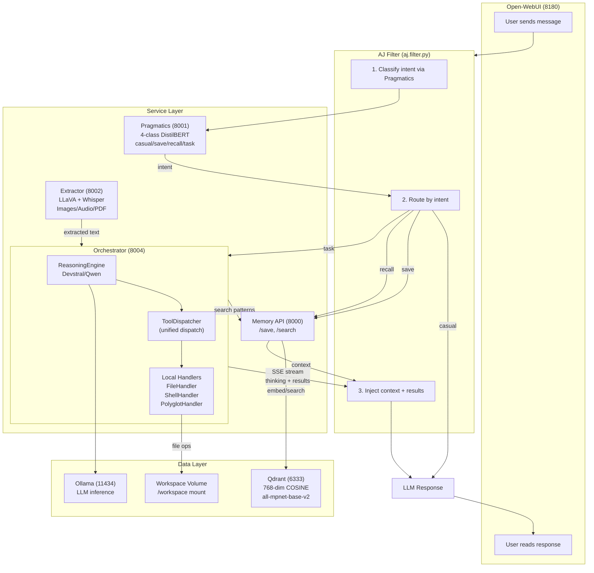
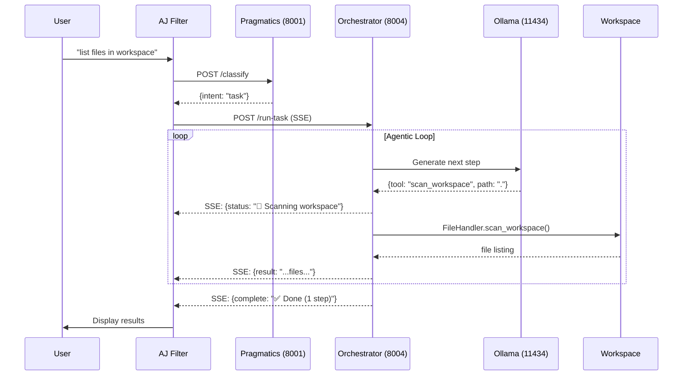
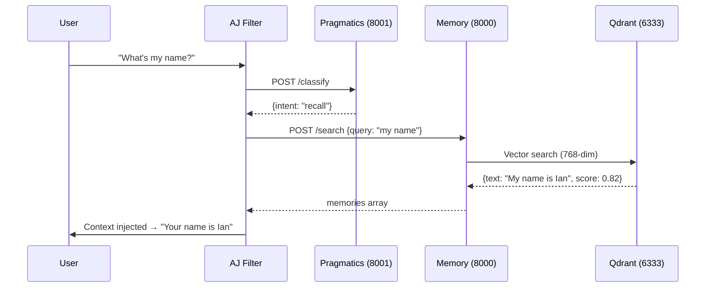

# Mesosync Architecture Documentation

> **AJ** is the user-facing persona • **Mesosync** is the coordination backbone • **FunnelCloud** agents extend reach

## Overview

Mesosync is a **Knowledge-centric AI platform**. The system accumulates knowledge about workspaces, systems, and patterns — then recalls that knowledge when relevant.

### Current Capabilities (Mesosync Core)

- **Semantic Memory** — Stores and retrieves conversation context from Qdrant using intent classification (4-class: casual/save/recall/task)
- **Workspace Operations** — Read, list, scan, and edit files in mounted workspace
- **Surgical File Editing** — Replace, insert, append operations with sandbox enforcement
- **Code Execution** — Python, Node.js, and PowerShell execution in sandboxed environment
- **Knowledge Persistence** — Save workspace knowledge to Qdrant for later recall

### Planned Capabilities (FunnelCloud Agents)

- **Distributed Execution** — .NET 8 agents on any machine the user controls
- **Agent Discovery** — UDP broadcast per-conversation, lazy re-discovery on failure
- **Trust Model** — mTLS with build-time CA fingerprint pinning
- **Credential Elevation** — Try-then-elevate with session+agent scoped credentials

See [docs/FunnelCloud-Design.md](docs/FunnelCloud-Design.md) for the FunnelCloud roadmap.

---

## System Architecture



**Key Architectural Decisions:**

- **Executor merged into Orchestrator** — No HTTP hop for tool execution (direct local calls via `tool_dispatcher.py`)
- **Singleton handlers** — `FileHandler`, `ShellHandler`, `PolyglotHandler` created once, reused
- **Unified tool dispatch** — Both `orchestrator.py` and `parallel_executor.py` use shared `tool_dispatcher.py`
- **Extractor batch endpoint** — Single HTTP call for all files + images (was N calls)

---

## Services

### 1. AJ Filter (filters/aj.filter.py)

The main entry point running inside Open-WebUI.

**Responsibilities:**

- Classify user intent via Pragmatics API
- Delegate all task intents to Orchestrator for reasoning
- Stream SSE events from Orchestrator during task execution
- Search memory for relevant context
- Inject context and results into LLM conversation

**Status Icons (displayed to user):**

| Icon | Meaning   | Used For                            |
| ---- | --------- | ----------------------------------- |
| 🧠   | Reasoning | Model thinking/generating           |
| ⏳   | Loading   | Model cold start, progress          |
| 📂   | Scanning  | `scan_workspace`                    |
| 📁   | Listing   | `list_dir`                          |
| 📖   | Reading   | `read_file`                         |
| 📝   | Writing   | `write_file`                        |
| ✏️   | Editing   | `replace_in_file`, `insert_in_file` |
| ➕   | Appending | `append_to_file`                    |
| 🗑️   | Deleting  | `delete_file`                       |
| 🔧   | Running   | `execute_shell`                     |
| ▶️   | Executing | `execute_code`                      |
| 🔎   | Searching | `search_files`, `grep`              |
| ⚙️   | Working   | Fallback for other tools            |
| ⚠️   | Failed    | Error in tool execution             |
| ✅   | Done      | Task completed                      |

**Progress Display Format:**

```
🧠 Reasoning...
📂 Scanning workspace — Looking for project files
📖 Reading config.py — Checking current settings
✏️ Editing README.md — Adding documentation
✅ Done (5 steps)
```

---

### 2. Pragmatics API (Port 8001)

4-class intent classification using fine-tuned DistilBERT.

**Classes:**

| Class    | ID  | Description                   | Example                 |
| -------- | --- | ----------------------------- | ----------------------- |
| `casual` | 0   | General chat, no action       | "How are you?"          |
| `save`   | 1   | User sharing info to remember | "My name is Ian"        |
| `recall` | 2   | User asking about past info   | "What's my email?"      |
| `task`   | 3   | User requesting action        | "Add credits to readme" |

**Endpoint:**

```
POST /api/pragmatics/classify
Input:  { "text": "insert a credit in the readme" }
Output: { "intent": "task", "confidence": 0.99, "label": 3 }
```

### 3. Orchestrator API (Port 8004) — With Integrated Executor

Agentic reasoning engine with **integrated tool execution** for direct tool calls.

**Architecture:**

```
orchestrator/
├── api/
│   └── orchestrator.py        # FastAPI endpoints, SSE streaming
├── services/
│   ├── reasoning_engine.py    # LLM interaction, step generation
│   ├── task_planner.py        # Batch planning
│   ├── parallel_executor.py   # Concurrent step execution
│   ├── tool_dispatcher.py     # ⭐ Unified tool routing (DRY)
│   ├── workspace_state.py     # External state tracking
│   ├── memory_connector.py    # Pattern retrieval
│   ├── file_handler.py        # File operations
│   ├── shell_handler.py       # Shell commands
│   └── polyglot_handler.py    # Code execution
└── schemas/
    └── models.py              # Pydantic models
```

**Tool Dispatcher (`tool_dispatcher.py`):**

Central module that routes tool calls to appropriate handlers:

```python
async def dispatch_tool(tool: str, params: dict, workspace_context) -> dict:
    """
    Unified tool dispatch - used by orchestrator.py and parallel_executor.py.
    Returns: {"success": bool, "output": str, "error": str|None}
    """
```

**Supported Tools:**

| Tool              | Handler         | Description            |
| ----------------- | --------------- | ---------------------- |
| `read_file`       | FileHandler     | Read file contents     |
| `write_file`      | FileHandler     | Overwrite entire file  |
| `replace_in_file` | FileHandler     | Surgical find/replace  |
| `insert_in_file`  | FileHandler     | Insert at position     |
| `append_to_file`  | FileHandler     | Add to end of file     |
| `delete_file`     | FileHandler     | Remove file            |
| `list_dir`        | FileHandler     | Directory listing      |
| `scan_workspace`  | FileHandler     | Recursive glob search  |
| `execute_code`    | PolyglotHandler | Python/Node/PowerShell |
| `execute_shell`   | ShellHandler    | Shell commands         |
| `none`            | (no-op)         | Skip with reason       |
| `complete`        | (signal)        | Task completion        |

**scan_workspace Features:**

- **Gitignore support**: Respects `.gitignore` patterns via `pathspec` library
- **Pretty output**: Unified table with NAME, TYPE, SIZE, MODIFIED columns
- **Hidden files**: Skips dotfiles and `.git` by default
- **Human-readable sizes**: Shows KiB, MiB, etc.

**SSE Streaming Endpoint:**

```
POST /api/orchestrator/run-task (SSE stream)
Events:
  - status: Current step info with icon (📂 Scanning workspace...)
  - thinking: Reasoning output tokens
  - result: Tool execution result
  - error: Error information
  - complete: Final summary
```

**Permission Checks:**

- `allow_file_write` — Required for write/replace/insert/append/delete
- `allow_shell_commands` — Required for shell execution
- `allow_code_execution` — Required for Python/Node/PowerShell

---

### 4. Memory API (Port 8000)

Semantic memory storage and retrieval.

**Components:**

- **Embedder:** SentenceTransformer `all-mpnet-base-v2` (768-dim, L2-normalized)
- **Storage:** Qdrant vector database
- **Summarizer:** DistilBART (optional)
- **Fact Extractor:** KeyBERT + regex for importance filtering

**Endpoints:**

```
POST /api/memory/save
  - Check importance (skip casual queries)
  - Embed with SentenceTransformer
  - Upsert to Qdrant
  - Return existing_context

POST /api/memory/search
  - Embed query
  - Search Qdrant (threshold: 0.35)
  - Return matching memories

GET /api/aj/filter
  - Serve filter source code
```

---

### 5. Extractor API (Port 8002)

Media-to-text extraction (GPU-accelerated).

**Models:**

- **Image:** LLaVA-1.5-7B (4-bit) or Florence-2 fallback
- **Audio:** Whisper (base model)
- **PDF:** PyMuPDF

---

### 6. Orchestrator API (Port 8004)

Multi-step reasoning and task planning using **Devstral-Small-2 (24B)**.

**Endpoints:**

```
POST /api/orchestrate/set-workspace   # Set workspace context
POST /api/orchestrate/next-step       # Get next tool + params (with history)
POST /api/orchestrate/execute-batch   # Execute multiple steps
```

**Role:** The Orchestrator is the "brain" that decides which tool to use. All task intents are delegated to it - there are no hardcoded patterns in the filter.

**Model Choice: Devstral-Small-2:24B**

Selected for agentic reasoning because:

- Designed for agentic coding tasks
- Strong multi-step reasoning capability
- Excellent JSON output formatting
- 32K context window for history tracking
- Good error recovery and adaptation

**Feedback Loop:**

The orchestrator receives step history with each request:

```json
{
  "task": "user request",
  "history": [
    { "step_id": "step_1", "status": "success", "output": "..." },
    { "step_id": "step_2", "status": "failed", "error": "..." }
  ]
}
```

This allows the model to:

- Adapt strategy based on failures
- Use gathered information in subsequent steps
- Know when to complete vs continue

---

## Data Flow

### Task Request Flow (SSE Streaming)



### Memory Search Flow



---

## Configuration

### Environment Variables

| Variable                      | Service               | Default             | Purpose                       |
| ----------------------------- | --------------------- | ------------------- | ----------------------------- |
| `HOST_WORKSPACE_PATH`         | Orchestrator/Executor | `C:/Code`           | Host directory for /workspace |
| `QDRANT_HOST`                 | AJ                    | `qdrant`            | Vector DB hostname            |
| `QDRANT_PORT`                 | AJ                    | `6333`              | Vector DB port                |
| `CLASSIFIER_MODEL`            | Pragmatics            | `distilbert_intent` | Intent model name             |
| `INTENT_CONFIDENCE_THRESHOLD` | Pragmatics            | `0.50`              | Min confidence for intent     |
| `IMAGE_MODEL`                 | Extractor             | `llava-4bit`        | Vision model                  |
| `WHISPER_MODEL`               | Extractor             | `base`              | Audio transcription model     |

### Docker Compose Services

```yaml
services:
  memory_api: 8000 # Memory + Filter serving
  pragmatics_api: 8001 # Intent classification
  extractor_api: 8002 # Media extraction (GPU)
  orchestrator_api: 8004 # Task planning + Execution (merged)
  qdrant: 6333 # Vector database
  ollama: 11434 # LLM inference
  open-webui: 8180 # Chat UI
```

**Note:** `executor_api` (8005) has been **removed** — functionality merged into `orchestrator_api`.

---

## File Structure

```
aj/
├── docker-compose.yaml
├── ARCHITECTURE.md           # This file
├── filters/
│   └── aj.filter.py          # Main Open-WebUI filter
├── layers/
│   ├── memory/
│   │   ├── main.py               # FastAPI app
│   │   ├── api/memory.py         # /save, /search endpoints
│   │   └── services/
│   │       ├── embedder.py       # SentenceTransformer
│   │       ├── qdrant_client.py  # Qdrant connection
│   │       └── summarizer.py     # DistilBART
│   ├── pragmatics/
│   │   ├── server.py             # FastAPI app
│   │   ├── services/classifier.py # DistilBERT 4-class
│   │   └── static/distilbert_intent/  # Trained model
│   ├── extractor/
│   │   ├── main.py
│   │   └── services/
│   │       ├── image_extractor.py  # LLaVA/Florence
│   │       └── audio_extractor.py  # Whisper
│   └── orchestrator/             # ⭐ Includes executor functionality
│       ├── main.py
│       ├── api/
│       │   └── orchestrator.py      # SSE streaming, endpoints
│       ├── services/
│       │   ├── reasoning_engine.py  # LLM step generation
│       │   ├── task_planner.py      # Batch expansion
│       │   ├── memory_connector.py  # Pattern retrieval
│       │   ├── parallel_executor.py # Parallel step execution
│       │   ├── workspace_state.py   # External state tracking
│       │   ├── tool_dispatcher.py   # ⭐ Unified tool routing (DRY)
│       │   ├── file_handler.py      # read/write/replace/insert/append
│       │   ├── polyglot_handler.py  # Python/Node/PowerShell
│       │   └── shell_handler.py     # Shell commands
│       └── schemas/
│           └── models.py            # Pydantic models
└── .github/
    └── copilot-instructions.md
```

---

## Security

### Workspace Sandbox

- All file operations validate paths against `workspace_root`
- Paths outside workspace are rejected
- Write operations require explicit `allow_file_write: true`

### Permission Flags

```python
class WorkspaceContext:
    workspace_root: str       # Sandbox boundary
    cwd: str                  # Current directory
    allow_file_write: bool    # Enable write operations
    allow_shell_commands: bool # Enable shell execution
    allow_code_execution: bool # Enable code runners
    allowed_languages: List[str] # Permitted languages
```

---

## Documentation

| Document                                                           | Purpose                                 |
| ------------------------------------------------------------------ | --------------------------------------- |
| [ARCHITECTURE.md](ARCHITECTURE.md)                                 | This file — current system architecture |
| [docs/FunnelCloud-Design.md](docs/FunnelCloud-Design.md)           | FunnelCloud distributed agents design   |
| [.github/copilot-instructions.md](.github/copilot-instructions.md) | AI coding assistant guidance            |
| [README.md](README.md)                                             | Project overview and quickstart         |

---

## Development

### Filter Sync

After editing `filters/aj.filter.py`, sync to Open-WebUI:

```powershell
# Use utf-8-sig encoding to strip BOM (prevents parse errors)
$apiKey = (Get-Content "secrets/webui_admin_api_key.txt" -Raw).Trim()
python -c "import requests; f=open('filters/aj.filter.py',encoding='utf-8-sig').read(); r=requests.post('http://localhost:8180/api/v1/functions/id/api/update', headers={'Authorization':'Bearer $apiKey'}, json={'id':'api','name':'AJ','content':f,'meta':{'toggle':True}}, timeout=10); print(r.status_code)"
```

### Rebuild Services

```powershell
# Rebuild orchestrator after code changes
docker compose build --no-cache orchestrator_api
docker compose up -d orchestrator_api

# Rebuild all
docker compose up -d --build
```

### Test Endpoints

```powershell
# Intent classification
Invoke-RestMethod -Uri 'http://localhost:8001/api/pragmatics/classify' `
  -Method Post -ContentType 'application/json' `
  -Body '{"text":"add credits to readme"}'

# Orchestrator health
Invoke-RestMethod -Uri 'http://localhost:8004/health'

# Memory search
Invoke-RestMethod -Uri 'http://localhost:8000/api/memory/search' `
  -Method Post -ContentType 'application/json' `
  -Body '{"user_id":"test","query_text":"my name","top_k":5}'
```
